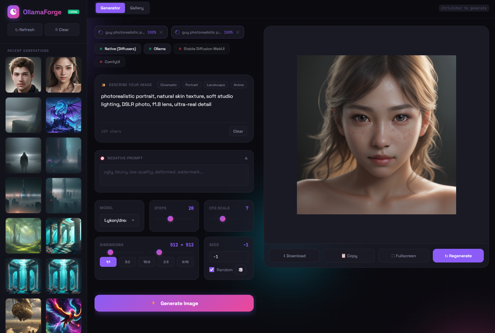

# OllamaForge - Local AI Image Generator



A sleek, modern web interface for generating AI images locally on your machine. Supports multiple backends including native Diffusers, Stable Diffusion WebUI, Ollama, and ComfyUI. Built with performance and ease of use in mind.


## Features

- **Multiple Backends**: Native Diffusers (GPU accelerated), SD WebUI, Ollama, ComfyUI
- **Live Preview**: Watch your images evolve step-by-step during generation
- **GPU Acceleration**: Optimized with CUDA support for fast generation
- **Concurrent Generation**: Queue multiple images at once
- **Modern UI**: Clean, responsive interface with glassmorphic design
- **Dark Theme**: Easy on the eyes with smooth animations
- **Generation History**: Automatically saves all generated images
- **Full Gallery**: Browse all your creations in a beautiful grid view
- **Quick Actions**: Download, copy, and fullscreen with one click
- **Keyboard Shortcuts**: Ctrl+Enter to generate, Escape to close lightbox

## Quick Start

### Prerequisites

- Python 3.8 or higher
- NVIDIA GPU (recommended for best performance)
- CUDA Toolkit (for GPU acceleration)

### Installation

1. Clone the repository:
```bash
git clone https://github.com/rar-file/OllamaForge.git
cd OllamaForge
```

2. Create and activate a virtual environment:
```bash
python -m venv .venv
.venv\Scripts\activate  # Windows
source .venv/bin/activate  # Linux/Mac
```

3. Install dependencies:
```bash
pip install -r requirements.txt
```

### Usage

1. Start the server:
```bash
python server.py
```

2. Open your browser and navigate to:
```
http://localhost:6010
```

3. Select your preferred backend and start generating!

## Supported Backends

### Native Diffusers (Default)
- **Fastest**: Optimized for local GPU acceleration
- **Models**: dreamshaper-8, Arcane-Diffusion, stable-diffusion-v1-5, and more
- **Features**: Live preview, model warmup, xFormers optimization

### Stable Diffusion WebUI
- **Endpoint**: `http://localhost:7860`
- **Features**: Advanced samplers, negative prompts, full SD WebUI features

### Ollama
- **Endpoint**: `http://localhost:11434`
- **Note**: Requires MLX support (Mac only)

### ComfyUI
- **Endpoint**: `http://localhost:8188`
- **Features**: Node-based workflow support

## Screenshots

### Generator View
Clean interface with all controls on the left, generated image on the right with live preview updates.

### Gallery View
Browse all your generated images in a beautiful grid layout.

### Lightbox
Full-screen image viewing with download and copy options.

## Configuration

### GPU Optimization
The server automatically detects and uses CUDA if available. Models are pre-loaded on startup for instant first generation.

### Custom Models
Edit `server.py` to add your favorite models:
```python
MODELS = {
    "custom-model": {
        "repo": "author/model-name",
        "name": "Custom Model",
        "type": "Stable Diffusion"
    }
}
```

### Port Configuration
Change the default port (6010) in `server.py`:
```python
PORT = 8080  # Your preferred port
```

## Keyboard Shortcuts

- `Ctrl + Enter` - Generate image
- `Escape` - Close lightbox/modal
- Click outside modal - Close modal

## Project Structure

```
ollamaforge/
├── server.py          # Python backend server
├── index.html         # Frontend interface
├── history/           # Generated images storage
├── requirements.txt   # Python dependencies
├── .gitignore        # Git ignore rules
└── README.md         # This file
```

## Advanced Features

### Live Preview
Images update every 3 diffusion steps, showing the generation progress in real-time.

### Generation Queue
Generate multiple images concurrently. Queue status shown with progress bars.

### Smart Caching
Models are kept in memory for instant subsequent generations.

### Optimizations
- xFormers for memory-efficient attention
- VAE slicing for large images
- Float16 precision for speed
- Eval mode for inference

## Troubleshooting

### "No backend available"
Make sure at least one backend is running:
- For native: Dependencies installed correctly
- For SD WebUI: Server running on port 7860
- For Ollama: Server running on port 11434

### Slow generation
- Ensure CUDA is available: Check `torch.cuda.is_available()`
- Use lower resolution or fewer steps
- Close other GPU-intensive applications

### Out of memory
- Reduce image resolution
- Lower batch size to 1
- Enable VAE slicing (already enabled by default)

## Contributing

Contributions are welcome! Please feel free to submit a Pull Request.

## License

This project is licensed under the MIT License - see the [LICENSE](LICENSE) file for details.

## Acknowledgments

- [Stable Diffusion](https://github.com/Stability-AI/stablediffusion) - The foundation model
- [Diffusers](https://github.com/huggingface/diffusers) - Hugging Face's diffusion library
- [AUTOMATIC1111](https://github.com/AUTOMATIC1111/stable-diffusion-webui) - SD WebUI
- All the amazing model creators on Hugging Face

## Support

For issues, questions, or suggestions, please open an issue on GitHub.

---

Made for the AI art community
